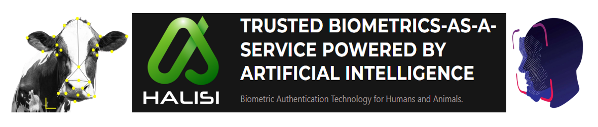

**Multi-species biometric authentication library, developed by [Fit For Purpose Technologies SRL](https://fitforpurpose.tech/).**
___

[Introduction](#introduction) •
[Getting Started](#getting-started) •
[Docs](https://fitforpurpose.tech/) •
[License](https://github.com/FFPTech/Halisi/edit/main/EarlyAdopterProgram/LICENSE)

___

## Introduction

This repository contains demo using [Halisi](https://fitforpurpose.tech/halisi/) Multi-species Biometric Authentication API, developed by [Fit-For-Purpose Technologies AI Lab](https://fitforpurpose.tech/). These APIs are hosted on the [RapidAPI Hub](https://rapidapi.com/hub). The [Halisi Human Face Detection API](https://rapidapi.com/FitForPurposeTechnologies/api/halisi-human-face-detection/) and [Halisi Animal Face Detection](https://rapidapi.com/FitForPurposeTechnologies/api/halisi-animal-face-detection/) APIs perform Face Detection on base-64 encoded image inputs and output bounding box coordinates of the detected faces alongwith other information. You can also pass Confidence and IoU thresholds as input parameters, optionally.

Halisi is intended to be easy to use, even by non-experts to overcome  the challenges of fraud in the animal claim (insurance), identity fraud, and secured access to digital platforms. 

## Installation
### Prerequisite
1. Python 3.6.0+
2. OpenCV
3. RapidAPI KEY

## Getting Started
1. We get started by first Signing Up or Logging in to [RapidAPI Hub] (https://rapidapi.com/hub).
2. Navigate to the [Halisi Animal Face Detection](https://rapidapi.com/FitForPurposeTechnologies/api/halisi-animal-face-detection/) page and click the "Subscribe to Test". 
3. Step 2 generates a unique RapidAPI key which you will need to run the python test script in this repository.
4. You can also unlock Halisi features on RapidAPI and stay tuned on that platform for more releases!
5. Clone this repository in your local system (make sure you have Python installed).
6. CD to the project folder.
7. Copy the API Key and paste it in the face_detection.py script as indicated in the comments. Also modify Confidence and IOU thresholds (default values for both are set to 0.45).
8. You can add more images to the folder - ./images OR choose images from local storage
9. Once you are ready with steps 1-8, run the script face_detection.py.

## Early Adopter Program
With the Early Adopter Program, you can plug our Halisi API into your applications. Subscribe to our APIs on RapidAPI or follow our page on social media to stay updated!

## To-dos
1. Release Enrollment and Verification of Cattle
2. Release Enrollment and Verification of Humans

## Documentation
Check this [wiki page](https://github.com/FFPTech/Halisi/tree/main/EarlyAdopterProgram/wiki/Reference) page for the reference.
The full documentation for halisi can be found on our [website](https://fitforpurpose.tech/halisi/).

## Contact Info

If you have any questions that cannot be addressed by raising an issue, feel
free to reach us by [email](https://fitforpurpose.tech/contact/)

Follow us on:

